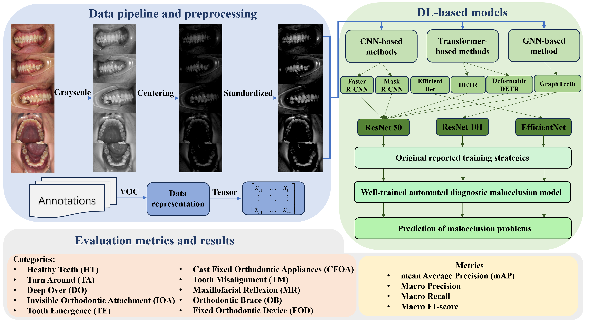

# Oral Imaging for Malocclusion Issues Identification: Dataset, Deep Learning Models and Benchmark
## Introduction
This is the official code repo of *Oral Imaging for Malocclusion Issues Identification: Dataset, Deep Learning Models and Benchmark*.

In this project, 6 deep learning models were reproduced and evaluated, including three CNN-based models, two Transformer-based models, and one GNN-based model. In addition, we use these 6 widely used deep learning models as benchmarks, which have never been applied to automated diagnosis of malocclusion before. For a detailed description, please refer to our paper.

All benchmarked models are evaluated on: the OMNI Dataset.

## Dataset
The datasets we used for benchmark are [OMNI Dataset](https://pan.baidu.com/s/12MT8fBAPMWXpnBGDOsYGhw?pwd=OMNI).

* OMNI includes 4161 RGB images of the oral cavity captured by a standard RGB camera, which are recorded from multiple views, including frontal occlusal, left occlusal, right occlusal, maxillary craniofacial, and mandibular craniofacial. All images are labeled with multiple malocclusion issues by professional dentists.
* OMNI dataset consists of 4161 RGB dental images collected from a total of 384 Chinese participants, including 153 males and 231 females. The age distribution of these participants ranged from 3-48 years old, with a mean age of 10.4 years old and a standard deviation of 5.63.
* OMNI dataset captured images of involved 901 frontal occlusal photographs, 841 left occlusal photographs, 842 right occlusal photographs, 815 maxillary maxillofacial photographs, and 762 mandibular maxillofacial photographs. We may continue to expand this dataset in the future.
  
